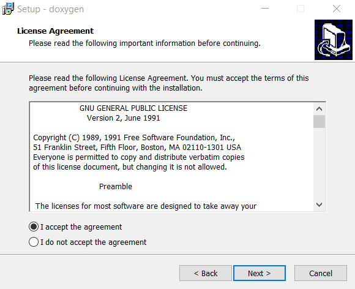
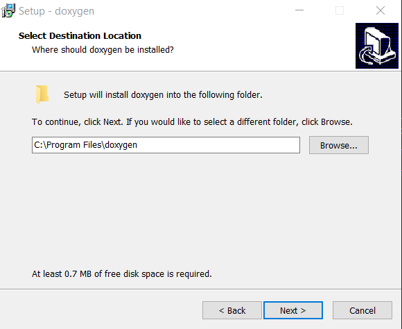
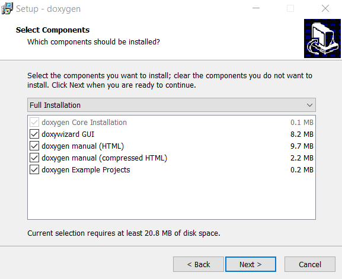
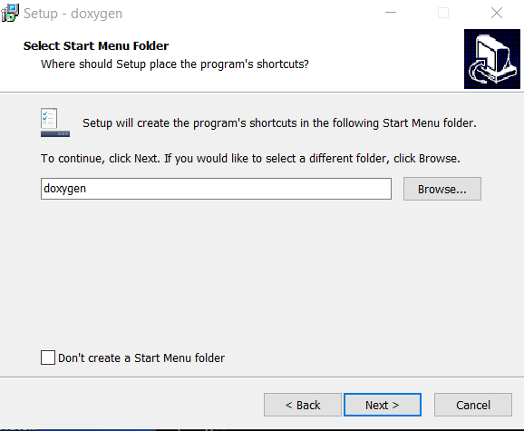
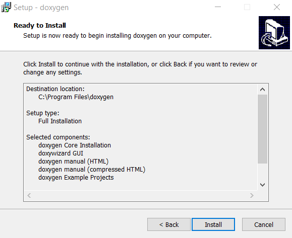
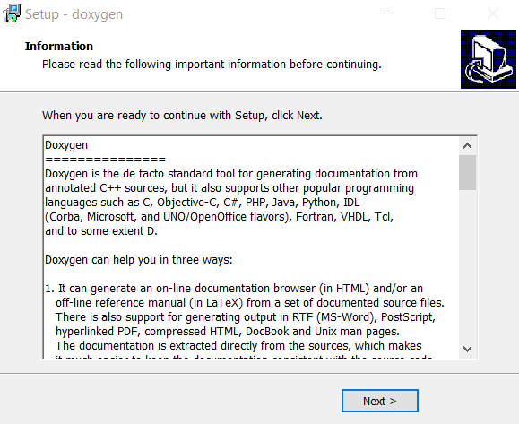
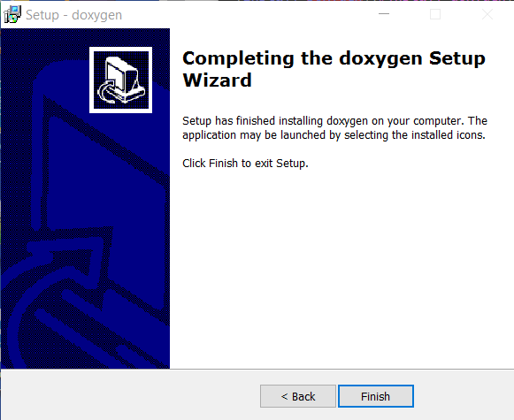
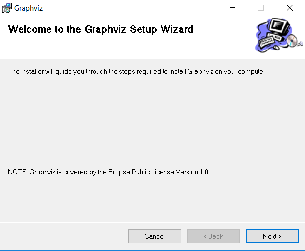
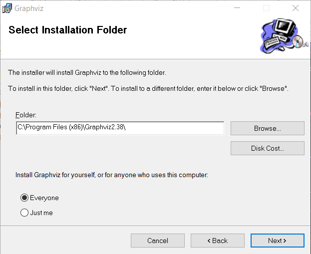
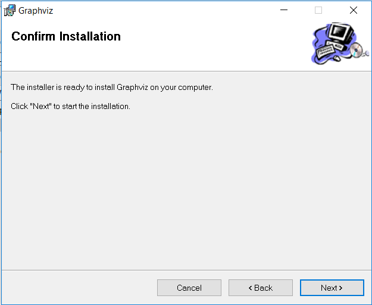

# Development Environment / Doxygen #

Doxygen is a software tool for generating documentation from code comments.
This minimizes the need to create code documentation outside of code.
Doxygen also creates diagrams that illustrate how code modules call each other.
Doxygen will be evaluated to determine whether it can help document StateMod code.
See the following resources:

* [Doxygen website](http://www.stack.nl/~dimitri/doxygen/)
* [Doxygen download page](http://www.stack.nl/~dimitri/doxygen/download.html)

This documentation includes the following sections:

* [Install Doxygen](#install-doxygen)
	+  [Linux](#linux)
	+  [Windows](#windows)
* [Install GraphViz](#install-graphviz)
* [Configure Doxygen Project](#configure-doxygen-project)

-------------

## Install Doxygen ##

###  Linux ###

**TODO smalers 2016-12-31 this documentation will be completed once the Windows documentation is complete.**

###  Windows ###

Download the Doxygen Windows installer from the download page, which will have a name similar to `doxygen-1.8.13-setup.exe`.
Run the installer as administrator and complete the following steps.

## Install GraphViz ##

The GraphViz software is needed to create the graphs showing how code modules call each other.
Use the following to download a Windows version of GraphViz:

* [Softpedia GraphViz Review](http://www.softpedia.com/get/Others/Miscellaneous/Graphviz.shtml)

After downloading, run the installer program as follows.

## Configure Doxygen Project ##

A Doxygen project is configured as part of the [Initial Project Setup / Doxygen](../project-init/doc-doxygen/) - **do not do now**.
