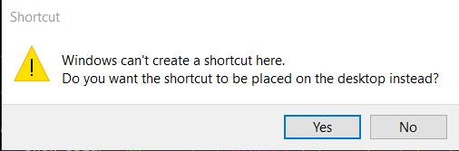

# Development Environment / Eclipse and Photran #

Eclipse is used for the integrated development environment (IDE).
The Eclipse Photran plugin is used to provide a Fortran IDE, which can facilitate editing code, debugging, etc.
Eclipse may not be needed if a suitably full-featured text editor is used.
The following Eclipse/Photran download page indicates that Eclipse Mars is required.

* [Downloading Photran](https://eclipse.org/photran/download.php) - indicates Eclipse version and provides other information links
* [PTP/photran/documentation/photran8installation](http://wiki.eclipse.org/PTP/photran/documentation/photran8installation) - recommends installation approach

This documentation includes the following sections:

* [Prerequisites](#prerequisites)
* [Install Eclipse and Photran](#install-eclipse-and-photran)
	+  [Linux](#linux)
	+  [Windows](#windows)
* [Next Steps](#next-steps)

-------------

## Prerequisites ##

The prerequisites for installing Eclipse are:

* [Java 8](java8) - Java is needed to run Eclipse
* [`gfortran` compiler](gfortran) - Eclipse relies on `gfortran` and other development tools having been installed in MinGW, Cygwin, or Linux

## Install Eclipse and Photran ##

The Photran installation instructions recommend installing Eclipse for Parallel Application Developers, which will install support for C, Fortran, and other tools.
Although there is currently not a need to develop StateMod for parallel processing,
this may be a need for StateMod in the future so this environment may have benefits.
It is also typically easier to pick a standard Eclipse installer rather than having to piecemeal plug-in installation.
Use the following link:

* [Eclipse Downloads](http://www.eclipse.org/downloads/eclipse-packages/)

This will default to the newest environment, which is Neon.  Based on the Photran documentation, use the older Mars version.
Therefore, use the links on the right side of the download page to access Eclipse Mars downloads:

* [Eclipse Mars](http://www.eclipse.org/mars/)

Then click on the ***Download*** link to see:

* [Eclipse Mars 2 Packages](http://www.eclipse.org/downloads/packages/release/Mars/2)

Select the ***Eclipse for Parallel Application Developers*** link for the appropriate operating system.

###  Linux ###

**TODO smalers 2016-12-31 add this documentation after Windows environment has been fully documented.**

###  Windows ###

The Windows installer will have a filename similar to `eclipse-parallel-mars-2-win32-x86_64.zip` and will save to the `Downloads` folder.

Eclipse is distributed as a zip file.  Therefore, a program like [7zip](http://www.7-zip.org/download.html) is needed to install.

The top-level folder in the zip file will be `eclipse`.
Because it is possible to install multiple versions of Eclipse (for example the Java package will be used to develop Java software),
it is recommended that the install location have a name specific to the version.
For example, unzip to `C:\Program Files\Eclipse\eclipse-parallel-mars-64`, renaming the top folder.
It may be easier to unzip in the `Downloads` folder, rename, and then copy into the `C:\Program Files\Eclipse` folder.
The resulting folder structure will be similar to:

```text
C:\Program Files\
     Eclipse\
         eclipse-parallel-mars-64\
             eclipse.exe
             eclipse.ini
             etc.
```

It is possible to create a desktop shortcut to Eclipse.
However, before doing so, it is recommended to create a batch file to run eclipse,
as per the [Initial Project Setup / Eclipse Run Script](../project-init/eclipse-run-script/).
The batch file is the recommended way to start Eclipse for StateMod development;
however, the desktop shortcut is a convenience for general Eclipse use.

The above script can be double-clicked on or run from a Windows Command Shell.
If necessary, the default script can be copied and modified for a specific developer.

**TODO smalers 2017-01-01 need to circle around to describe this in the repository and also other setup, such as MinGW environment variable setup.**

To create a shortcut, use Windows File Explorer and right-click on the `C:\Program Files\Eclipse\eclipse-parallel-mars-64\eclipse.exe` file
and select ***Create shortcut***.  On Windows 10, the following warning may be shown:



Press ***Yes***.  A shortcut labeled ***eclipse.exe Shortcut*** will be shown on the desktop.
Right-click on the icon and select ***Properties***.  Then change the properties as follows,
**consistent with the Eclipse run script**:

* Change the name to something like ***Eclipse Parallel Mars 64***.
* Change the ***Shortcut*** tab ***Target*** to be similar to the batch file above:
`"C:\Program Files\Eclipse\eclipse-parallel-mars-64\eclipse" -vm "C:\Program Files\Java\jre8\bin\java" -vmargs -Xmx700M`

Double-clicking on the shortcut desktop icon should then run the desired Eclipse.

## Next Steps ##

Additional Eclipse configuration will be performed after finishing development environment setup, as per the
[Initial Project Setup](../project-init/overview/) documentation - **do not do now**.
