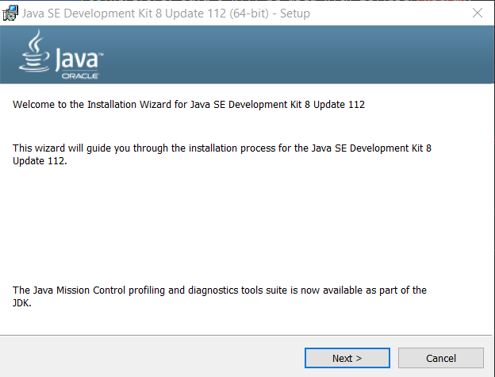
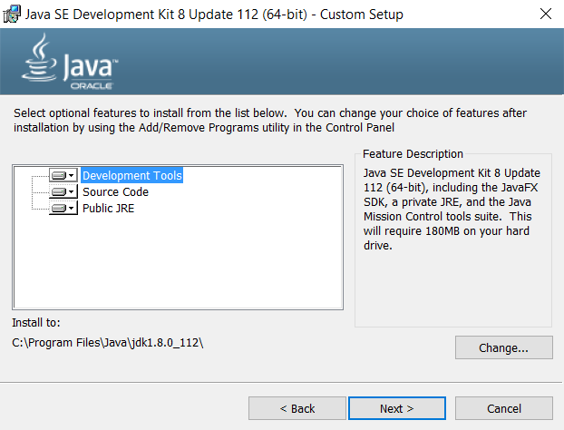
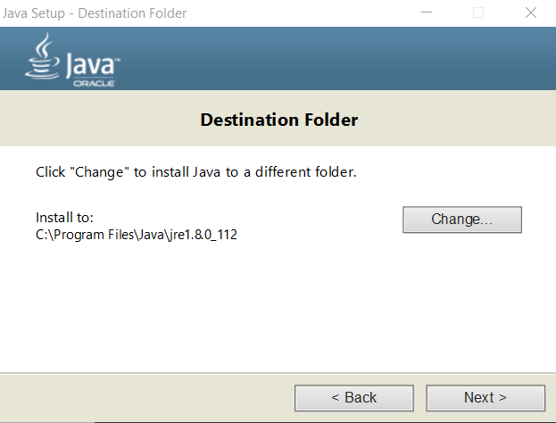
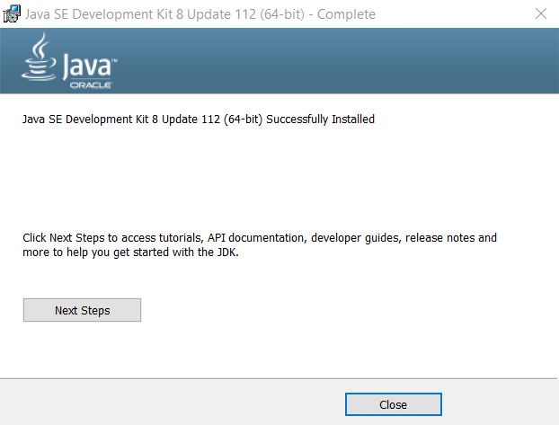

# Development Environment / Java 8 #

Eclipse is used for the integrated development environment (IDE) and Eclipse requires Java to run.
The Eclipse Photran plugin is used to provide a Fortran IDE.
The following Eclipse/Photran download page indicates that Eclipse Mars is required:

* [Downloading Photran](https://eclipse.org/photran/download.php) - **however, don't download Photran yet - that is described in a later step**

Mars requires at least Java 7 but Java 8 is being phased in with other CDSS tools.
Therefore, Java 8 will be used with Eclipse/Photran.

This documentation includes the following sections:

* [Install Java 8](#install-java-8)
	+  [Linux](#linux)
	+  [Windows](#windows)

---------------------

## Install Java 8 ##

###  Linux ###

**TODO smalers 2016-12-31 complete this after Windows environment has been fully documented**

###  Windows ###

First, check whether Java 8 needs to be installed:

```text
> java -version

> dir \Program Files\Java
```

If Java 8 is not installed (no version is output and a Java 8 version is not listed under installed programs),
then installing Java 8 from Oracle is recommended:

* [Java SE Development Kit 8 Downloads](http://www.oracle.com/technetwork/java/javase/downloads/jdk8-downloads-2133151.html)

Select the Windows x64 download for Windows 7 and 10.
The specific update is generally not important.  Select the most recent stable version, for example `jdk-8u112-windows-x64.exe`.
Accept the license agreement and download.

Run the installer program as administrator.





Accept the defaults by pressing ***Next >***.



Accept the defaults by pressing ***Next >***.



Press ***Close***.  The above process will result in the following files being installed (version will be different for newer installs).
The Java Developer Kit (JDK) contains the `javac` program that compiles Java (not needed for StateMod).
The Java Runtime Environment (JRE) is used to run compiled Java programs (used to run Eclipse).

```text
C:\Program Files\
    Java\
        jdk1.8.0_112\  
        jre1.8.0_112\  
```

#### Create Symbolic Links ####

The paths with detailed version numbers can be specified in software like Eclipse, as needed.
However, it is also helpful to create symbolic links to generalize scripts and configurations that use Java.
To do so, run a Windows Command Shell as administrator and run the following.
In the future the symbolic links can be recreated to point to newer versions of Java.

```com
> cd \Program Files\Java

C:\Program Files\Java>mklink /d jdk8 jdk1.8.0_112
symbolic link created for jdk8 <<===>> jdk1.8.0_112

C:\Program Files\Java>mklink /d jre8 jre1.8.0_112
symbolic link created for jre8 <<===>> jre1.8.0_112

> dir

 Volume in drive C is OS
  Volume Serial Number is 8C0B-FCB1

   Directory of C:\Program Files\Java

   01/01/2017  02:15 AM    <DIR>          .
   01/01/2017  02:15 AM    <DIR>          ..
   01/01/2017  02:05 AM    <DIR>          jdk1.8.0_112
   01/01/2017  02:15 AM    <SYMLINKD>     jdk8 [jdk1.8.0_112]
   01/01/2017  02:05 AM    <DIR>          jre1.8.0_112
   01/01/2017  02:15 AM    <SYMLINKD>     jre8 [jre1.8.0_112]

```
