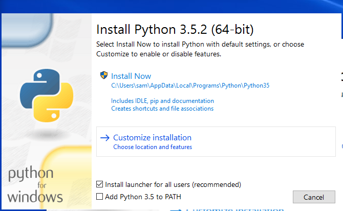
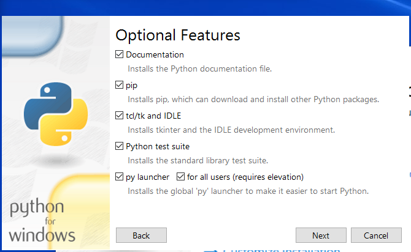
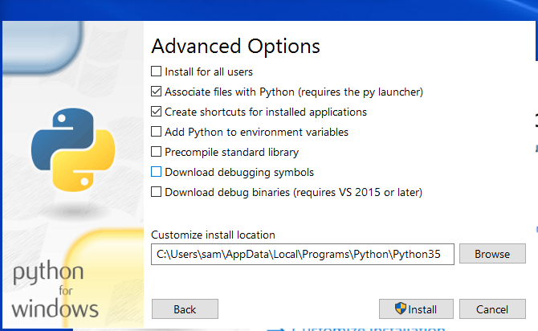
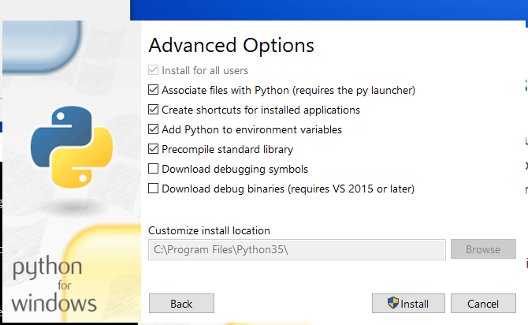
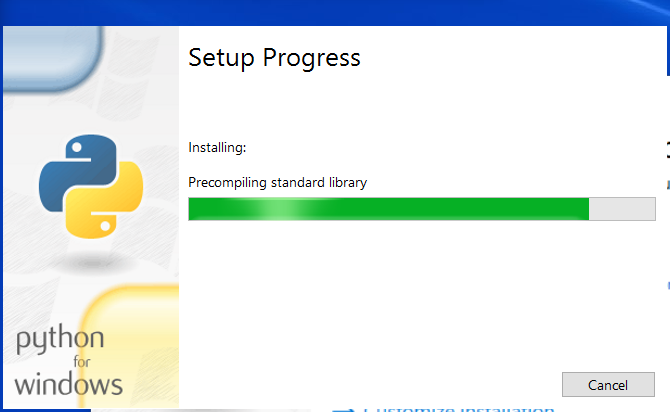
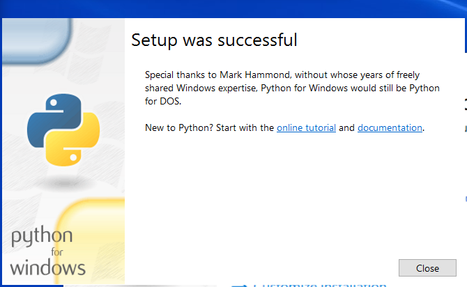

# Development Environment / Python and pip #

Python is used by the MkDocs documentation software, which formats this static website documentation from Markdown files.
Python is also used by the `pytest` automated test framework, which may be used for functional testing.
Python is also a useful program for creating data processing scripts, including processing spatial data using Geographic Information System
software.
`pip` is a tool used to install Python packages.

This documentation contains the following sections:

* [Install Python](#install-python)
	+  [Linux](#linux)
	+  [Windows](#windows)
* [Install `pip`](#install-pip)
	+  [Linux](#linux)
	+  [Windows](#windows)

-------------------------- 

## Install Python ##

It is recommended that Mkdocs is installed with Python 3.5 (or latest stable version), as described below.
This will ensure that it is up to date and will not interfere with Python that may be used by GIS tools.

###  Linux ###

**TODO smalers 2016-12-31 fill this out after Windows documentation is complete**

###  Windows ###

Download Python 3.5.2 (or latest available) for Windows from the [Python Download site](https://www.python.org/downloads/windows/),
selecting the ***Windows x86-64 executable installer***,
and save in the `Downloads` folder for the user.

Run the installer as administrator (will be prompted for authorization as the process continues).
If the following indicates that the 32-bit version is being installed, then the wrong installer was downloaded
because it is assumed that a 64-bit development environment will be used.



Select ***Customize installation*** to ensure that the installation will be for all users.



Note selections for ***py launcher*** and ***for all users (requires elevation)***,
which means that administrator login will be requested.  Press ***Next***.



The above shows the install being for the single user (***Install for all users*** is unchecked).
Change by selecting ***Install for all users***,
which will change the install location to `C:\Program Files\Python35`.

Also set the environment variables to have Python added to `PATH`, by selecting ***Add Python to environment variables***.
Otherwise, add-on programs like `pip` and `mkdocs` won't be found when typed on the command line and will need
to be run with longer command line syntax, for example, instead of:

```
pip
```

will need to use:

```com
py -m pip
```

Making the recommended installation selections will change the dialog to the following.
Note that the installation folder is now defaulted to the shared software location.



Press ***Install*** to install.  The following progress will be shown:



The following is shown to indicate a successful installation.




## Running Python ##

Modern Python installations, when installed to the shared system location (not installed to user files), will install the `py` program
in the Windows software location, `C:\Windows`, which is always in the `PATH`.
Verify that `py` is available by running the following in a Windows Command Shell:

```com
> where py

```


The `py` program will by default run the latest Python but can specify which Python to run:

* `py` - run latest Python version
* `py -2` - run the latest Python 2 version
* `py -3` - run the latest Python 3 version
* `py somefile.py` - run the specified Python module

The `py` program essentially wraps all Python versions and also provides a way to always run Python without conflicts in the `PATH` environment variable.
Note that it may not be necessary to use `py` if a custom script is used to run a Python program, and directly specifies the Python version to run
by specifying the path to the Python executable, for example `C:\Program Files\Python35\python.exe`.

## Install `pip` ##

The [`pip` software](https://pip.pypa.io/en/stable/) is used to install Python packages and is the preferred installation tool since older tools such as `easy_install`
do not support current conventions.  Therefore, in order to install third-party packages, install `pip` first.
See the following resources:

* [Installing Packages](https://packaging.python.org/installing/) - should use `pip` if possible
* [Stack Overflow article on using `pip` when multiple Python versions are installed](http://stackoverflow.com/questions/10919569/how-to-install-a-module-use-pip-for-specific-version-of) -
it is possible

In summary:

* Add-on packages should install into a location consistent with the Python software install location.
* The `pip` utility should be used to install add-on packages.
* It is possible to use `pip` to install modules when multiple versions of Python are installed.
See the examples below for specific operating systems.

###  Linux ###

**TODO smalers 2016-12-31 fill this out after Windows documentation is complete**

###  Windows ###

The following uses a Windows Command Shell.  To check for whether pip is already installed,:

```com
py -3 -m pip --version
pip 8.1.2 from C:\Users\sam\AppData\Local\Programs\Python\Python35-32\lib\site-packages (python 3.5)

```

If not installed, install with the following:

```com
py -3 -m ensurepip
```
