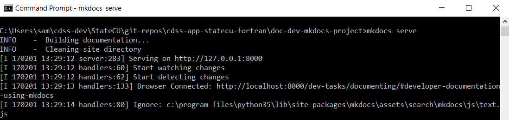

# Development Tasks / Documenting

Documenting software for developers and users is one of the most important software developer tasks,
in particular for open source projects that rely on collaboration to ensure a sustainable project.
Without documentation, software can be confusing to understand and code may be rewritten when it does not need to be.

This documentation includes the following documentation:

* [Developer Documentation Using MkDocs](#developer-documentation-using-mkdocs)
* [User Documentation Using MkDocs](#user-documentation-using-mkdocs)
* [Fortran Code API Documentation Using Doxygen](#fortran-code-api-documentation-using-doxygen)
* [Fortran Code Internal Documentation Using Comments](#fortran-code-internal-documentation-using-comments)

---------------

## Developer Documentation Using MkDocs

This developer documentation uses MkDocs and should be updated appropriately to keep the documentation current.
See the [Initial Project Setup / Documentation, Develper (MkDocs)](../project-init/doc-dev/)
for background on how the documentation is configured.
If using the standard development files structure,
the developer documentation is located in `~/cdss-dev/StateMod/git-repos/cdss-app-statemod-fortran/doc-dev-markdown-project`.
See the following resources for information on MkDocs and Markdown:

* [MkDocs - Writing your docs](http://www.mkdocs.org/user-guide/writing-your-docs/)
* [Markdown on Wikipedia](https://en.wikipedia.org/wiki/Markdown)
* [commonmark.org Markdown reference](http://commonmark.org/help/)

### Run MkDocs Server to View Documentation

MkDocs runs a local Python web server that allows the browser to view the documentation.
To start the server, change to the folder where the documentation configuration file exists and start the server.
This should work for Windows command shell, Git Bash running on Windows or Linux, and Linux command shell,
depending on the development environment.

```
> cd \Users\userName\cdss-dev\StateMod\git-repos\cdss-app-statemod-fortran\doc-dev-mkdocs-project
> mkdocs serve
```

The following indicates that the server is running.  If an error is shown, it is usually because the
`mkdocs.yml` file lists a file that does not yet exist or the file has a syntax problem such as mis-matched quotes.
If a problem occurs, fix the problem and try restarting the server.



Then view the documentation in a web browser using the address `http://localhost:8000`.
The MkDocs server will generally auto-detect changes to files and the browser will refresh.
When auto-refresh does not happen, manually refresh to see changes.

Stop the server with `Ctrl-C` in the command shell window.

### Publish the documentation.

Currently the StateMod developer documentation is published to the
[Learn StateMod (for Developers) static website](http://learn.openwaterfoundation.org/owf-learn-cdss-statemod-dev/)
hosted by the Open Water Foundation.
This may continue or may evolve into a website hosted by the State of Colorado or open source project page.

The `site` folder under the MkDocs project is copied to an Amazon S3 bucket using the following batch file (Windows example).
The developer must have the proper credentials to copy the files.

```
> C:
> cd \Users\user\cdss-dev\StateMod\cdss-app-statemod-fortran\doc-dev-mkdocs-project\build-util
> copyToOwfAmazonS3.bat
```

## User Documentation Using MkDocs

The user documentation for StateMod currently uses Microsoft Word and is distributed as PDF.
That documentation has not yet been included in the StateMod repository.

**TODO smalers 2017-01-10 Need to discuss with WWG what should be done with existing Word documentation - could
add to `doc-user-manual` or `doc/UserManual` folder in repository, for example.**

An option for going forward is to use MkDocs for user documentation, and a placeholder folder has been added to
the repository.
See the [Initial Project Setup / Documentation, User (MkDocs)](../project-init/doc-user/)
for background on how the documentation is configured.
If using the standard development files structure,
the user documentation is located in `~/cdss-dev/StateMod/git-repos/cdss-app-statemod-fortran/doc-user-markdown-project`.

## Fortran Code API Documentation Using Doxygen

The StateMod subroutines, functions, and modules should be documented using Doxygen-style comments.
See the following resources:

* [Doxygen - Comment blocks in Fortran](http://www.stack.nl/~dimitri/doxygen/manual/docblocks.html#fortranblocks)
* [NASA Modeling Guru:  Using Doxygen with Fortran soruce code](https://modelingguru.nasa.gov/docs/DOC-1811)

**TODO smalers 2017-01-10 need to discuss with the team how agressively to add new comments to StateMod code as part of OpenCDSS project,
in order to make it easier for new developers to understand the code.**

Refer to the [Initial Project Setup / Documentation, API (Doxygen)](../project-init/doc-doxygen/) documentation for how to run Doxygen.

Currently, Doxygen is intended as a local developer tool.
If StateMod code is packaged into a library, then the Doxygen-generated API code can be published for developers that use the library.

## Fortran Code Internal Documentation Using Comments

The Fortran code files that comprise the StateMod software should be documented with in-line comments
using Fortran conventions to facilitate understanding of variables, data structures, modules, functions,
subroutines, etc.

**TODO smalers 2017-01-10 need to provide some specific examples for guidance.**
