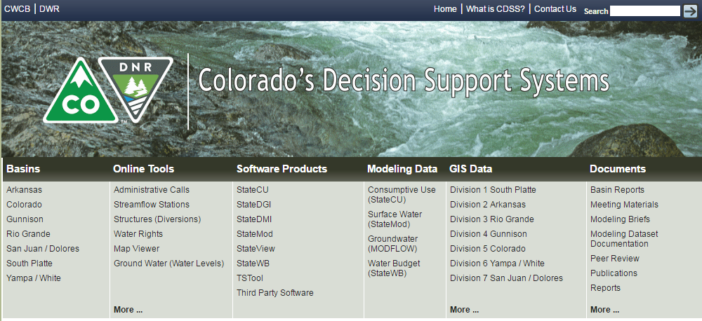

# Learn StateMod (for Software Developers) #

This documentation is the developer manual for Colorado's Decision Support Systems (CDSS) StateMod water allocation model software.

**This documentation is a work in progress and will contain notes for inserts until resources can
be devoted to fill gaps.  Comments in the code with text "TODO smalers 2017-01-01 some text" (for example)
are included to indicate work that needs to be completed.**

If you are reading this documentation, you have an interest in learning how StateMod is designed,
are a member of the software development team,
or perhaps wish to contribute software code enhancements or otherwise provide input to the project.
This documentation is intended to provide sufficient information to software developers
to streamline understanding of the StateMod code and developer environment.
It is expected that software developers are technically competent and
follow conventions of the open source StateMod project.

This documentation page includes the following sections:

* [How to Use this Documentation](#how-to-use-this-documentation) - guidance and list of main documentation sections
* [Colorado's Decision Support Systems](#colorados-decision-support-systems) - the system under which the software is maintained
* [Open Water Foundation](#open-water-foundation) - lead organization for moving StateMod to open source project
* [License](#license) - license for software and this documentation
* [Source Repository on GitHub](#source-repository-on-github) - location of StateMod repository in GitHub
* [MkDocs](#mkdocs) - the tool used to create this documentation

------------

## How to Use this Documentation ##

This website is a companion to the StateMod source code and provides guidance for
software developers that modify and support StateMod.

The documentation is organized with the first sections focusing on setup for a new developer and common development tasks.
The reference sections at the end provide information that may be of use but are typically not used day to day.
Use the search feature of this website to find specific information.

It is the intended to create StateMod executable programs for Windows (7, 10, +) and Linux, 32-bit and 64-bit,
although the Windows 32-bit version is the starting point and is initially the main focus.
This documentation includes information for these variants and will be filled out as resources can be applied to each configuration.
Icons for Linux  and Windows  are included to help indicate documentation
specific to an operating system.

* [New Developer Setup](dev-new/overview/) - **new StateMod software developers should start here**
* [Development Tasks](dev-tasks/overview/) - describes common development tasks - **refer to this after new development environment is configured**
* [REFERENCE: Software Design](software-design/overview/) - provides details about the software code design
* [REFERENCE: Deployed Environment](deployed-env/overview/) - describes the deployed environment after software is installed
* [REFERENCE: Development Environment](dev-env/overview/) - describes development environment software installation (some tools are shared between CDSS software projects)
* [REFERENCE: Initial Project Setup](project-init/overview/) - describes how the StateMod software project was initially configured

## Colorado's Decision Support Systems ##

Colorado's Decision Support Systems (CDSS, [cdss.state.co.us](http://cdss.state.co.us))
has been developed to answer important questions about Colorado's water resources.
CDSS efforts are led by the [Colorado Water Conservation Board (CWCB)](http://cwcb.state.co.us)
and [Colorado Division of Water Resources (DWR)](http://water.state.co.us).

One component of CDSS is the StateMod water allocation model, which estimates water allocation given water supply and demand and
physical and legal (water right) constraints on water decisions.
StateMod results are linked to the StateCU consumptive use model and in some basins the MODFLOW groundwater model.

In late 2016, the Open Water Foundation began the effort to move StateMod and other CDSS software to open source licensing
and establish open source software projects, referred to as "OpenCDSS", and this documentation is one project outcome.

## Open Water Foundation ##

The Open Water Foundation (OWF, [openwaterfoundation.org](http://openwaterfoundation.org)) is a 501(c)3 social enterprise
nonprofit that focuses on developing and supporting open source software to make better
decisions about water resources.  OWF is providing technical resources and management to
transition StateMod and other CDSS software to sustainable open source software projects.

See also other [OWF learning resources](http://learn.openwaterfoundation.org).

## License ##

The license for this documentation is being determined in the CDSS open source project.
More information will be provided later.

**TODO smalers 2017-01-09 need to determine software and documentation license.**

## Source Repository on GitHub ##

**TODO smalers 2016-12-31 this information will be finalized once the public code repository and open source project website is put into place.**

The source files for this documentation are maintained in the private GitHub repository for StateMod: [cdss-app-statemod-fortran](https://github.com/OpenWaterFoundation/cdss-app-statemod-fortran) in the `doc-dev-mkdocs-project` folder.
Documentation website files currently are copied to the Open Water Foundation [Learn StateMod (for Software Developers)](http://learn.openwaterfoundation.org/cdss-learn-statemod-dev/) website,
and will be copied to an OpenCDSS website once software tools are made available publicly.

## Release Notes ##

Release notes for StateMod and this documentation will be implemented as the open source migration is finalized.
