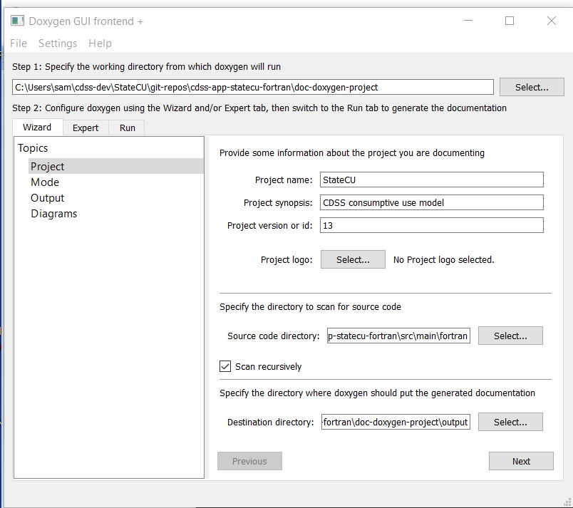
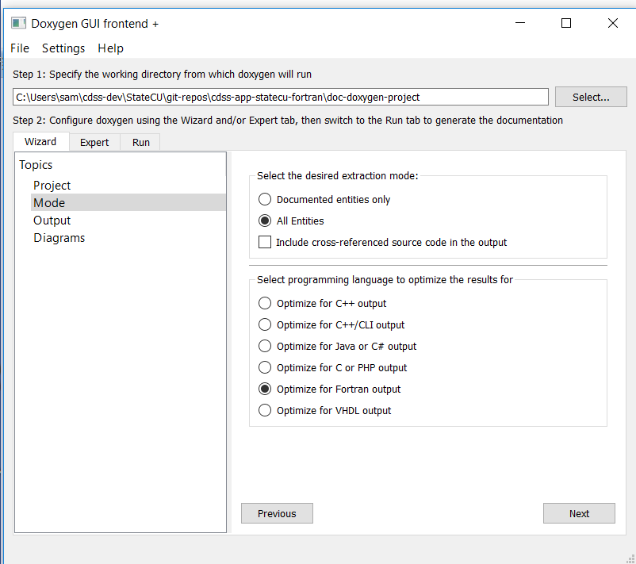
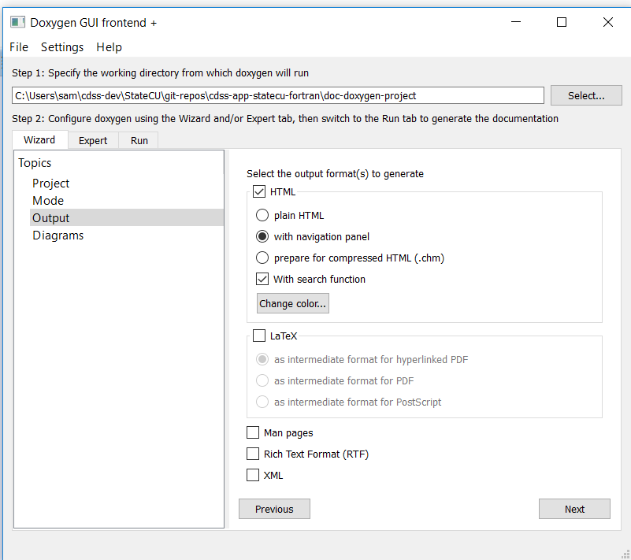
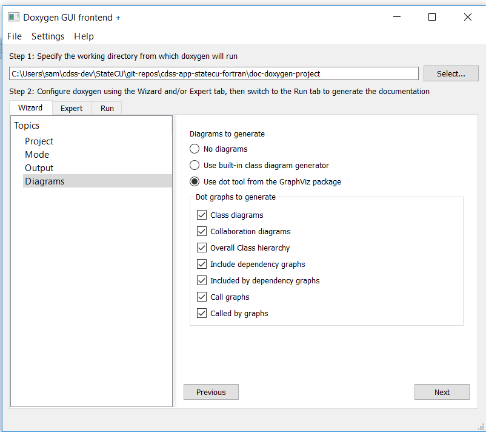
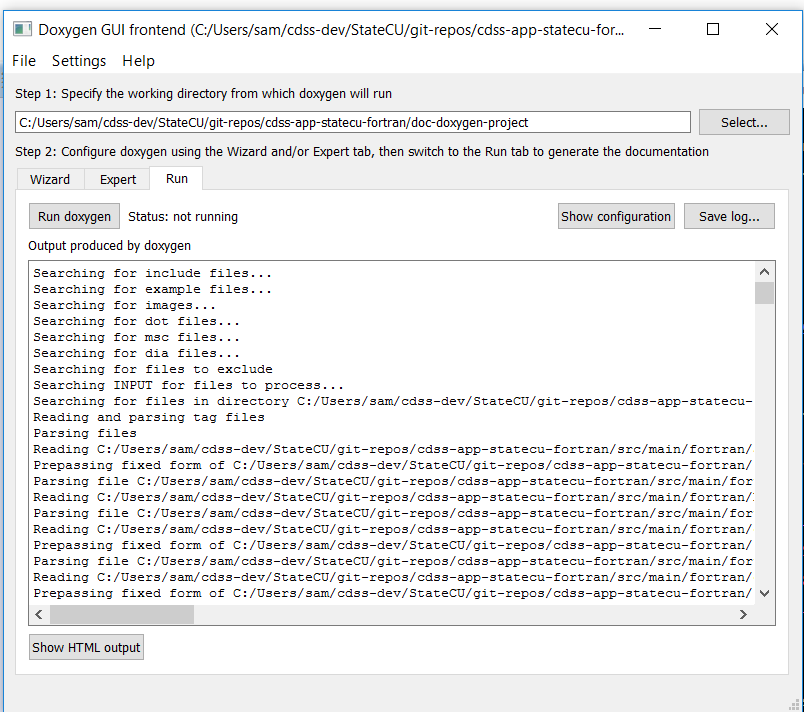
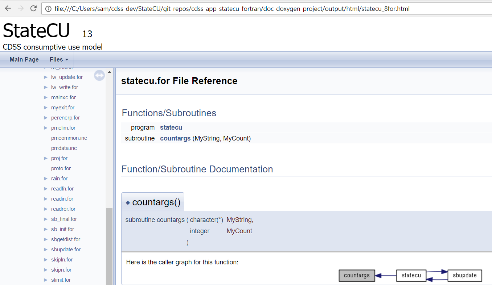

# Initial Project Setup / Documentation, API (Doxygen) #

**TODO smalers 2017-10-24 This documentation needs to be updated for StateMod.**

Doxygen software processes code comments to create subroutine/function API documentation that is useful for developers.
Doxygen can also be used to create graphs showing how code modules are connected.
The output of Doxygen is not intended to be saved in the repository but might be distributed and archived,
similar to model executables.

This documentation includes the following sections:

* [Prerequisites](#prerequisites)
* [Create Doxygen Project](#create-doxygen-project)
* [Review Doxygen Project File](#review-doxygen-project-file)
* [Run Doxygen](#run-doxygen)
* [Create .gitignore File](#create-gitignore-file)

-----------------

## Prerequisites ##

Configuring a Doxygen project requires that the [Doxygen software was previously installed](../dev-env/doxygen/),
including the GraphViz software.

## Create Doxygen Project ##

Run the Doxywizard interactively from the ***Start*** menu.  Fill out the project settings as shown below.

* Working directory: `doc-doxygen-project` - in the repository
* Project name: `StateMod` - will be shown in HTML output
* Project synopsis: `CDSS water allocation model` - will be shown in HTML output
* Project version or id: `15` - corresponds to StateMod version - will be shown in output (change version as code is updated)
* Source code directory: `src/main/fortran` in repository
* Destination directory: `doc-doxygen-project/output` - use `.gitignore` to ignore in repository









The ***Expert*** tab appears to be a direct way to set various properties.  Ignore for now.

Save the settings using ***File / Save*** menu and save to the `doc-doxygen-project` folder as `Doxyfile` default name.

## Review Doxygen Project File ##

The `Doxyfile` is a long file with many settings.  See the following information that explains important settings for Fortran:

* [Callgraph for Fortran with Doxygen](http://www.softeng-support.ac.uk/documents/2013/06/05/fortran-callgraph-doxygen.html)

The following settings are important:

```text
OPTIMIZE_FOR_FORTRAN = YES
EXTRACT_ALL = YES
EXTRACT_PRIVATE = YES
EXTRACT_STATIC = YES
HAVE_DOT = YES (see section for GraphViz install)
CALL_GRAPH = YES
CALLER_GRAPH = YES
DOT_PATH = "C:\Program Files (x86)\Graphviz2.38\bin\dot.exe"

```
**TODO smalers 2017-01-01 maybe also set EXTRACT_PACKAGE = YES?**

If the file is edited and saved, reselect in the Doxywizard software using ***File / Open recent*** and then rerun Doxygen.

## Run Doxygen ##

Try running by using the ***Run doxygen*** button under the ***Run*** tab.



The HTML output can be viewed as `doc-doxygen-project/output/index.html`.
If the output is complete (for example no graphs shown) and/or errors are shown in the wizard, check the configuration file
as discussed in the previous section and follow instructions in the error message, such as
deleting the `output` folder and rerunning.  An example of output is shown below.



**TODO smalers 2017-01-02 need to decide whether to add target to makefile to auto-geneate in batch mode.**

## Create .gitignore File ##

A `.gitignore` file is created in the `doc-doxygen-project` folder to ignore the `output` folder.

**TODO smalers 2017-01-02 need to decide whether to distribute documentation outside of developer environment or
just let developers create for their own use as needed.**
